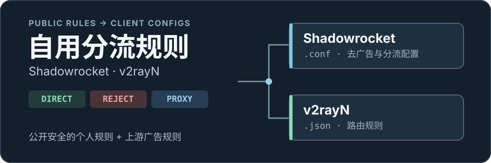

<p align="center">
  
</p>

# 自用 Shadowrocket 与 v2rayN 分流规则

结合上游广告规则与公开安全的个人分流规则，生成可直接下载的 **Shadowrocket 去广告配置**和 **v2rayN 路由规则**。域名策略分为 `DIRECT`（直连）、`REJECT`（拦截）和 `PROXY`（走客户端选定的代理节点）。

> **仅提供规则，不提供节点。**配置不包含代理账号、密码、UUID、订阅链接或家庭设备专用设置；它不是整台路由器的恢复包。

## 直接使用

### Shadowrocket / 小火箭

在 Shadowrocket 中从 URL 下载配置：

```text
https://raw.githubusercontent.com/cc519979682-cyber/-/main/sr_personal_whitelist_ad.conf
```

操作路径：`配置 → 右上角加号 → 从 URL 下载配置`。下载后，选择 `sr_personal_whitelist_ad.conf` 作为当前配置。

**使用 Tailscale 隧道时：**配置将 `100.64.0.0/10` 留在 TUN 内并前置直连，不交给普通代理节点。请保留原配置作为回退；更新后需在实际外网环境验证目标服务，仓库测试不能代替手机端连通性。

### v2rayN

v2rayN 的**节点订阅仍由你自己提供**；下面的链接只导入路由规则：

```text
https://raw.githubusercontent.com/cc519979682-cyber/-/main/v2rayn_personal_routing_rules.json
```

操作路径：`设置 → 路由设置 → 路由规则 → 从订阅 URL 导入规则`。导入后选择这套路由规则，再配合自己的节点订阅使用。

## 规则如何工作

- **DIRECT：**国内网站及明确需要本地出口的服务直连。
- **REJECT：**已列入规则的广告、追踪与统计域名尽量拦截。
- **PROXY：**明确属于国外服务的域名交给客户端当前选择的代理节点。
- **未命中：**交由生成配置中的最终规则处理。

这是一套「明确直连 + 广告拦截 + 其余代理」的自用策略。Shadowrocket 配置还对直连流量与代理流量分别设置 DNS 处理，以尽量减少离开家中网络后的解析问题；它不保证每个网络环境都没有 DNS 泄露。

## 生成与更新

[GitHub Actions 构建流程](.github/workflows/build.yml) 定期拉取上游广告规则底版，合并 `personal/rules.conf` 中的公开安全规则，再生成两份成品。平时订阅上面的原始文件链接即可获取更新，无需手动重新构建。

| 文件 | 用途 |
| --- | --- |
| [`sr_personal_whitelist_ad.conf`](sr_personal_whitelist_ad.conf) | Shadowrocket 成品配置 |
| [`v2rayn_personal_routing_rules.json`](v2rayn_personal_routing_rules.json) | v2rayN 路由规则 |
| [`personal/rules.conf`](personal/rules.conf) | 公开安全的个人分流规则 |
| [`scripts/build_personal_shadowrocket.py`](scripts/build_personal_shadowrocket.py) | 生成 Shadowrocket 配置 |
| [`scripts/build_v2rayn_routing.py`](scripts/build_v2rayn_routing.py) | 生成 v2rayN 路由规则 |

代理出口在公开配置中统一记为 `PROXY`，实际使用哪个节点由各客户端决定。住宅代理链、路由器 DNS、AdGuard 例外和设备专用规则不在这两份公开成品中。

### 路由器规则的公开安全同步

仓库的同步脚本可**只读导出**路由器里可公开的手写分流规则，转换后写入 `personal/rules.conf` 的 `// BEGIN router-sync` 与 `// END router-sync` 标记之间。只有规则变化时才提交；标记块由脚本维护，不应手工编辑。设置方法见 [同步脚本说明](scripts/nas/README.md)。

- 默认以路由器中可公开的规则为准；标记块外同一规则会去重，仓库独有的手写规则保留。`HAND_RULES_WIN=1` 可恢复手写规则优先的旧行为。
- 默认不展开第三方 `rule_set`；只有显式设置 `INCLUDE_RULE_SETS=1` 才会展开。
- 节点、订阅、凭据、设备规则、住宅出口和内网地址不应同步；单个主机 IP 与展开规则集中的直连 IP 段也会被过滤。
- 读不到规则、规则数异常骤减时，同步会停止，以免误清空公开配置。

## 安全边界

只把公开也无妨的域名规则放进仓库，例如：

```text
DOMAIN-SUFFIX,example.com,DIRECT
DOMAIN-SUFFIX,ads.example.com,REJECT
```

**不要提交**节点链接、机场订阅、VPS 专用 IP、UUID、Reality 密钥信息、密码、API key、完整 OpenClash 配置或私人路由器备份。敏感资料应保存在私有位置。公开配置不等于路由器的完整备份。

## 文档

- [小白恢复指南](docs/README-小白恢复指南.md)：配置故障后的恢复步骤。
- [Shadowrocket 规则说明](docs/shadowrocket-rules.md)：规则与 DNS 行为。
- [DNS 泄露排查](docs/dns-leak-troubleshooting.md)：排查思路。
- [更新记录](docs/changelog.md)：规则调整记录。
- [个人规则说明](personal/README.md)：可公开内容与同步边界。

## 本地维护

如果要从自己的规则导出一份公开安全的配置，可先准备已脱敏的规则文件，再运行：

```powershell
python scripts/build_personal_shadowrocket.py --refresh-from "C:\path\to\shadowrocket-soft-router-rules.conf" --drop-ip "x.x.x.x"
```

也可将不应公开的 IP 放进不会被 Git 提交的 `.private/drop_ips.txt`。提交前检查 `personal/rules.conf` 不含敏感信息、Shadowrocket 成品能正常生成，并在客户端实际验证常用网站和服务。
