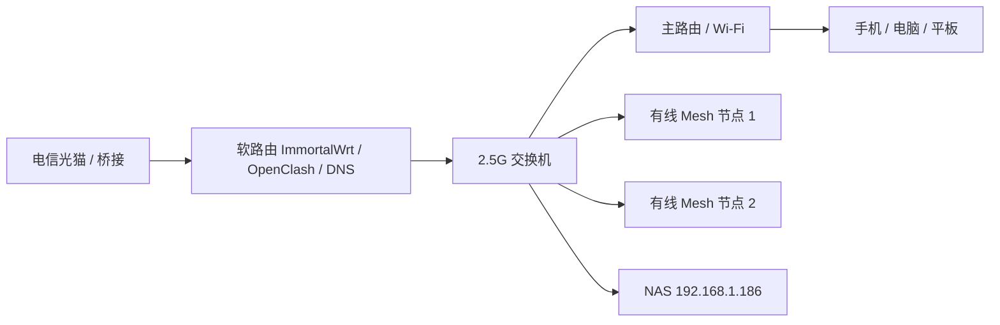

# 家庭网络拓扑

这是恢复用的拓扑说明，不代表实时状态。实际维护前要登录软路由再确认一次。

## 目标结构

## 角色分工

光猫：

- 负责光纤接入。
- 理想状态是桥接，让软路由拨号。

软路由：

- 家庭网络的大脑。
- 负责拨号、分流、DNS、广告拦截、内网直连。
- 管理地址通常是 `192.168.1.1`。

OpenClash：

- 负责国内直连、国外代理、AI/视频/特殊网站分流。
- 规则要稳定，不要随便删除成熟分组。

SmartDNS：

- 负责更灵活的 DNS 解析和缓存。
- 如果和 OpenClash 配合不好，先保证 OpenClash 正常，再慢慢优化 SmartDNS。

AdBlock Fast：

- 负责轻量广告过滤。
- 能拦一部分网页广告和广告域名，但不能保证去掉所有 App 开屏广告、YouTube 视频广告。

NAS：

- 局域网地址是 `192.168.1.186`。
- 必须直连，不应该走代理。
- 私人节点资料目录在 NAS 上，不放 GitHub。

## 重要直连对象

这些对象通常应该直连：

- 软路由管理地址：`192.168.1.1`
- NAS：`192.168.1.186`
- 国内银行、证券、淘宝、拼多多、夸克、像素蛋糕、HP 打印相关服务
- 国内网站和 `.cn`
- VPS 服务器自身 IP，避免代理连接自己造成回环

## 重要代理对象

这些对象通常应该走代理：

- ChatGPT / OpenAI / Codex
- Gemini / Claude
- YouTube
- X / Twitter
- TikTok
- Google
- 国外视频、国外开发者网站

## 操作习惯

- 修改 OpenClash 前先备份。
- 能不重启就先不重启。
- 重启要放在最后。
- 重启后要检查国内、国外、NAS、ChatGPT/Codex 四类场景。
